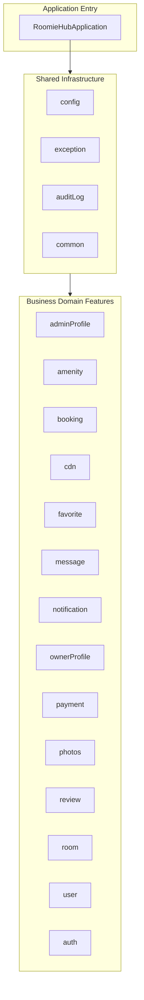

```markdown
# 🏠 RoomieHub - Thesis Rental Platform Backend

 
 


**RoomieHub** is a full-featured backend REST API for a modern room/apartment rental platform. Built with **Java 21 + Spring Boot 4**, it handles the complete rental lifecycle — from user management and room listings to bookings, reviews, real-time messaging, and admin tools.

This project was developed as my **thesis** and is my main **portfolio project** to demonstrate strong backend development and system design skills.

## ✨ Key Features

- User Management (Registration, JWT + Google OAuth2, roles: RENTER/OWNER/ADMIN)
- Room Listings with pagination, search & filtering
- Booking System with date validation and availability checks
- Reviews & Ratings (one review per booking)
- Favorites, Real-time Messaging (WebSocket + STOMP)
- Cloudinary CDN for photo uploads
- Audit Logging with JSON diff tracking
- System Settings, Amenities, Owner Profiles
- Role-based Access Control

**Total API Endpoints**: **65+**

## 📊 System Architecture

```mermaid
graph TD
    A[Client <br> Web Browser / Postman] --> B[Spring Boot App <br> (Docker Container)]
    B --> C[(PostgreSQL <br> Database Container)]
    B --> D[(Redis Cache <br> Container)]
    B --> E[Cloudinary <br> External Image API]
    
    subgraph Security [Authentication]
        F[JWT Token Filter]
        G[Google OAuth 2.0]
    end
    
    B --- F
    B --- G

    subgraph Docker_Network [Isolated Docker Network]
        B
        C
        D
    end
    
    style Docker_Network fill:#f9f,stroke:#333,stroke-width:2px
```

## 📂 Project Code Architecture (Package-by-Feature)



## 🔐 Security

- JWT Authentication
- OAuth2 Google Login
- BCrypt password encoding
- Role-based authorization with Spring Security

## ⚙️ Tech Stack

| Category           | Technology                              |
|--------------------|-----------------------------------------|
| Language           | Java 21                                 |
| Framework          | Spring Boot 4.0.4                       |
| Security           | Spring Security + JWT + OAuth2          |
| Database           | PostgreSQL + Flyway                     |
| ORM                | JPA / Hibernate                         |
| Mapping            | MapStruct + Lombok                      |
| Image Storage      | Cloudinary                              |
| Real-time          | WebSocket (STOMP)                       |
| Documentation      | SpringDoc OpenAPI / Swagger             |
| Containerization   | Docker + Docker Compose                 |
| Build Tool         | Maven                                   |

## 🚀 Quick Start

### 1. Clone the Repository
```bash
git clone https://github.com/VicheaStack/RoomieThesis.git
cd RoomieThesis
```

### 2. Environment Configuration (Secure Approach)
To run the app, you need a `.env` file. Copy the example template and fill in your own values:
```bash
cp docker.env.example docker.env
```
Edit `docker.env` and insert your local credentials, API keys, and secrets (see the `docker.env.example` file for required keys).

> ⚠️ **Note for security:** The `docker.env` and `.env` files are included in `.gitignore`. Your secrets will **never** be pushed to GitHub.

### 3A. Run with Docker (Containerized)
Spin up the entire stack (App, Postgres, Redis) using Docker Compose:
```bash
docker-compose up --build
```
Application will start at `http://localhost:8080`. Swagger UI: `http://localhost:8080/swagger-ui.html`

### 3B. Run Natively (For Rapid Development)
If you want to debug code in IntelliJ with hot-reload:
1. Start only the databases via Docker:
```bash
docker-compose up -d postgres redis
```
2. Run `RoomieHubApplication` via IntelliJ. Ensure your local environment uses `DB_URL=jdbc:postgresql://localhost:5432/roomiehub` (or set your active Spring profile to `local`).

## 🧪 Development & Testing

- **Hot-Reload workflow:** Native IntelliJ runs connect to Dockerized Postgres/Redis in seconds.
- Fixed **32+ JPA/Hibernate issues** during development.
- Over 60 endpoints tested with Postman.
- Basic Unit Tests (JUnit + Mockito).
- Audit logging for major operations.

## 🗺️ Future Improvements

- Complete Integration Tests
- Email notifications
- Rate limiting
- CI/CD with GitHub Actions
- React/Vue frontend integration

## 📄 License
GPL-3.0

PostMan Collection
https://vichea-8711.postman.co/workspace/JunitTest~fa0eff7b-98cc-47ea-a27f-39e9d538cf8e/collection/42535130-28189d14-70c6-4d67-90b9-2c684aee6de9?action=share&creator=42535130

---

**Built with ❤️ by Leng Chan Vichea**
```
