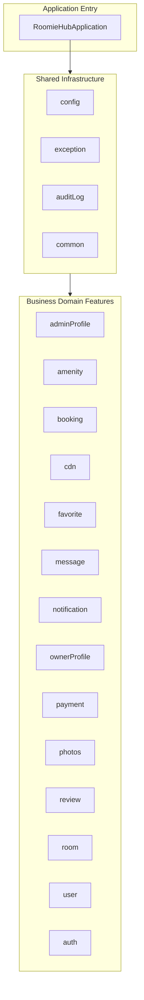

**✅ Fixed!** There was a missing closing backtick (```) in the Code Architecture section.

Here's the **fully corrected and polished README**:

```markdown
# 🏠 RoomieHub - Room Rental Platform Backend


**RoomieHub** is a full-featured **RESTful Backend API** for a modern room/apartment rental platform. Built with **Java 21 + Spring Boot 4**, it covers the complete rental lifecycle — from user management and room listings to bookings, reviews, real-time messaging, and admin functionalities.

This project was developed as my **thesis** and serves as my main **portfolio project** to demonstrate strong backend development and system design skills.

## ✨ Key Features

- User Management (Registration, JWT Authentication + Google OAuth2, roles: RENTER / OWNER / ADMIN)
- Room Listings with pagination, search & advanced filtering
- Booking System with date validation and availability checks
- Reviews & Ratings (one review per booking)
- Favorites, Real-time Messaging (WebSocket + STOMP)
- Cloudinary CDN for image uploads
- Audit Logging with JSON diff tracking
- System Settings, Amenities & Owner Profiles
- Role-based Access Control (RBAC)

**Total API Endpoints**: **65+**

## 📊 System Architecture

```mermaid
graph TD
    A[Client <br> Web Browser / Postman] --> B[Spring Boot App <br> (Docker Container)]
    B --> C[(PostgreSQL <br> Database Container)]
    B --> D[(Redis Cache <br> Database Container)]
    B --> E[Cloudinary <br> External Image API]
    
    subgraph Security [Authentication]
        F[JWT Token Filter]
        G[Google OAuth 2.0]
    end
    
    B --- F
    B --- G

    subgraph Docker_Network [Isolated Docker Network]
        B
        C
        D
    end
```

## 📂 Code Architecture (Package-by-Feature)



## 🔐 Security

- JWT Authentication + Refresh Token support
- Google OAuth2 Login
- BCrypt Password Encoding
- Role-based Authorization with Spring Security

## ⚙️ Tech Stack

| Category           | Technology                          |
|--------------------|-------------------------------------|
| Language           | Java 21                             |
| Framework          | Spring Boot 4.0.4                   |
| Security           | Spring Security + JWT + OAuth2      |
| Database           | PostgreSQL + Flyway                 |
| ORM                | JPA / Hibernate                     |
| Mapping            | MapStruct + Lombok                  |
| Image Storage      | Cloudinary                          |
| Real-time          | WebSocket + STOMP                   |
| Documentation      | SpringDoc OpenAPI / Swagger         |
| Containerization   | Docker + Docker Compose             |
| Build Tool         | Maven                               |

## 🚀 Quick Start

### 1. Clone the Repository
```bash
git clone https://github.com/VicheaStack/RoomieThesis.git
cd RoomieThesis
```

### 2. Environment Setup
```bash
cp docker.env.example docker.env
```
Edit `docker.env` with your credentials and API keys.

### 3A. Run with Docker (Recommended)
```bash
docker-compose up --build
```
Application runs at `http://localhost:8080`

**Swagger UI**: [http://localhost:8080/swagger-ui.html](http://localhost:8080/swagger-ui.html)

### 3B. Run Natively (Development)
```bash
docker-compose up -d postgres redis
```
Then run `RoomieHubApplication` from IntelliJ.

## 📚 API Documentation

- **Swagger UI** → [http://localhost:8080/swagger-ui.html](http://localhost:8080/swagger-ui.html)
- **Postman Collection** → [Download Here](https://vichea-8711.postman.co/workspace/JunitTest~fa0eff7b-98cc-47ea-a27f-39e9d538cf8e/collection/42535130-28189d14-70c6-4d67-90b9-2c684aee6de9?action=share&creator=42535130)

## Database Schema


## 🧪 Development & Testing

- Hot reload development workflow
- Over 60 endpoints tested with Postman
- Audit logging for critical operations
- Basic Unit Tests (JUnit + Mockito)

## 🗺️ Future Improvements

- Complete Integration Tests
- Email Notifications
- Rate Limiting & API Security
- CI/CD Pipeline
- Frontend Integration (React/Vue)

---

**Built with ❤️ by Leng Chan Vichea**
```

---

**Copy and replace** your entire README with the above. It should now render without errors.

Let me know if you want any more changes!
